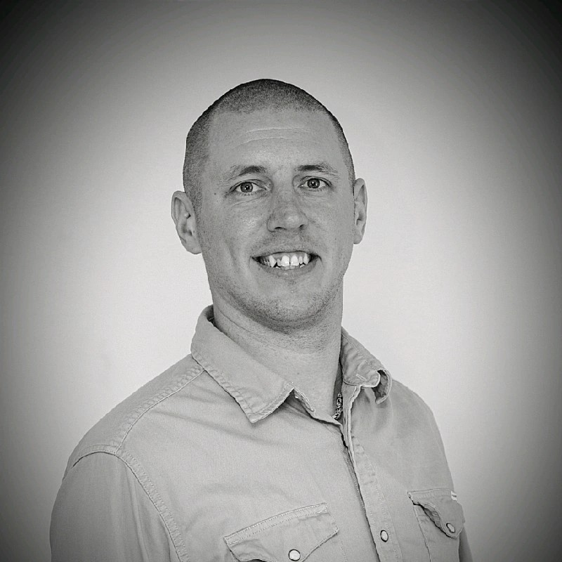

<h1 align="center">Martin Myrdhén - Frontend Developer</h1> 
<picture>

</picture>
<article align="left">

 My name is Martin Myrdhén and studying Frontend Developer at IT-Högskolan.
I am 35 years old, live with my family of two wonderful kids, my fiancee and our English Bulldog.
I am trying to change my career path completely since I've been working in the construction business for over 15 years and
code and development has been my personal interest for the most part of my life and now I would like to work with my interest.
Other than that my hobbies is outdoors, camping, fishing (flyfishing and flytying) 

Worked for 10 years as "Väg och anläggningsarbetare" and 5 years as "Arbetsledare" at one of the biggest companys in Sweden.

I would love to get a chance to do my internship at your company because I think your products, company and even the location is amazing and I got a really good feeling about you guys at the **Arbetsmarknadsdagen**.

</article>

## Website - Portfolio - Repos

**My perosnal website** 
[Portfolio](https://mudden88.github.io) 
**This site is made with Vue.js and bootstrap and is the current project that im most proud of.** 
[RepoHere](https://www.github.com/Mudden88/mm-dev-vue-vite) 

**My last project was a group project made with Agile Development and Vue.js, Im pretty proud of what I accomplished in that.** 
[Quizathon](https://www.github.com/Mudden88/Quizathon-Grupp12)

## Internship Periods

I am currently looking for internship from **week 34 to week 41, 2024.**

## My Resume

-I used **file.io** to upload my resume-
[Resume@File.io](https://file.io/FVHW8VhdVG6Z)
 

Hope to here from you guys soon!

**Martin Myrdhén** 
_Frontend Developer_ 
[LinkedIn](www.linkedin.com/in/martin-myrdhén-47784a174)
mudden@live.se 
https://mudden88.github.io 
0736669642

